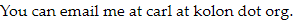

I'm a Software Engineer Intern at [Vannevar Labs](https://www.vannevarlabs.com/). I live in San Francisco. For 5 years I was a Submarine Officer in the US Navy. Before that, I was a [Trident Scholar](https://www.usna.edu/TridentProgram/index.php) in Mathematics at the US Naval Academy. This is my personal website.

I did a lot of math work at the Naval Academy. [You can read about it here](/research.html). The main topic of my research is the stability of mathematical swarm models. Currently, I'm interested in software and machine learning, especially automatic ways to prove stability and control nonlinear systems. [Check my blog to see what I'm up to](/blog.html).

{: .left-img}

[This is my public key.](/assets/media/publickey.asc)

I'm on LinkedIn as [Carl Kolon](https://www.linkedin.com/in/carl-kolon)

I'm on Twitter as [@CarlKolon](https://twitter.com/CarlKolon).

I'm on Github as [cckolon](https://github.com/cckolon).

My cat is on Instagram as [@rockminsterfullerene](https://www.instagram.com/rockminsterfullerene/).

My wife, Jackie, is an internal medicine resident at [UCSF](https://www.ucsf.edu/).
