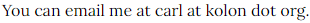

I'm a Submarine Officer in the US Navy, currently working in Norfolk, Virginia. At the US Naval Academy, I was a [Trident Scholar](https://www.usna.edu/TridentProgram/index.php) in Math. This is my personal website. Obviously, nothing posted here represents the opinions of the Navy or DoD.

{: .center-image}

I've done a lot of math work at the Naval Academy. [You can read about it here](research.html). The main topic of my research is the stability of mathematical swarm models.

[This is my public key.](/assets/media/publickey.asc)

I'm on LinkedIn as [Carl Kolon](https://www.linkedin.com/in/carl-kolon-18243a209)

I'm on Twitter as [@CarlKolon](https://twitter.com/CarlKolon).

I'm on Github as [cckolon](https://github.com/cckolon).

My cat is on Instagram as [@rockminsterfullerene](https://www.instagram.com/rockminsterfullerene/).

My wife, Jackie, is a 4th year medical student at [UCSF](https://www.ucsf.edu/), and will start her internal medicine residency there this summer.
