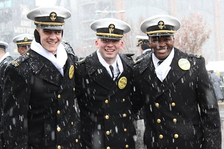
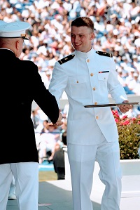
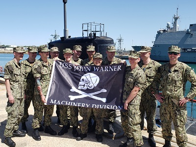

I'm a [Submarine Officer](https://www.navy.com/careers/nupoc-submarine-officer) in the US Navy. I spend a lot of time trying to become an officer that enlisted Sailors deserve.

In 2014, I accepted an appointment to the [US Naval Academy](https://www.usna.edu/homepage.php) in Annapolis, MD. I spent 4 years there, where I majored in Math. I graduated with distinction in 2018, commissioning as an Ensign in the US Navy.

My first assignment was to [Nuclear Power School](https://www.navsea.navy.mil/Home/NNPTC/) in Charleston, SC, where I spent 6 months learning the basics of naval nuclear propulsion. I graduated in February 2019. After that, I stayed in Charleston for Prototype, where I learned to stand watch on a real nuclear reactor (the [MTS-626](https://en.wikipedia.org/wiki/USS_Daniel_Webster_(SSBN-626)), a converted submarine). After qualifying Engineering Officer of the Watch (EOOW), I left Charleston to attend Submarine Officer Basic Course (SOBC) in Groton, CT. I graduated in December 2019.

In January, 2020, I reported to Norfolk, VA. I was temporarily assigned to [USS John Warner](https://en.wikipedia.org/wiki/USS_John_Warner_(SSN-785)), a [Virginia-class](https://en.wikipedia.org/wiki/Virginia-class_submarine) [attack submarine](https://en.wikipedia.org/wiki/Attack_submarine), and deployed with them in the spring of 2020. On John Warner I was the Main Propulsion Assistant (MPA), responsible for the ship's engines and nuclear mechanical systems. As MPA, I led a division of eleven nuclear-trained mechanics. I qualified in submarines in October, while underway.

Since returning to Norfolk in November 2020, I have served on [PCU New Jersey](https://en.wikipedia.org/wiki/USS_New_Jersey_(SSN-796)), a Virginia-class submarine under construction at [Huntington Ingalls](https://huntingtoningalls.com/) Naval Shipyard. In June 2021, I passed the Engineer's exam and graduated from [Prospective Nuclear Engineer Officer](https://allhands.navy.mil/Stories/Display-Story/Article/1839925/call-me-a-nuclear-engineer/) school.

People outside the Navy often ask me what my day-to-day job is. Every 3 or 4 days, I work a 24 hour duty day. During this time, I am responsible for the entire ship, and spend most of my time coordinating maintenance and testing. When I'm off duty, I work ordinary hours. In January 2022, I relieved as Assistant Engineer aboard New Jersey. In February 2022, I took over New Jersey's quality assurance program, managing maintenance and documentation of seawater-tight systems (for example, the [SUBSAFE](https://en.wikipedia.org/wiki/SUBSAFE) program). I am scheduled to leave New Jersey in May.
